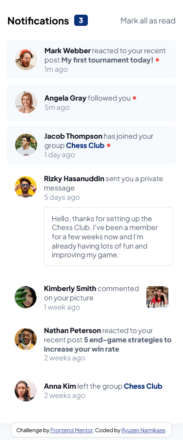
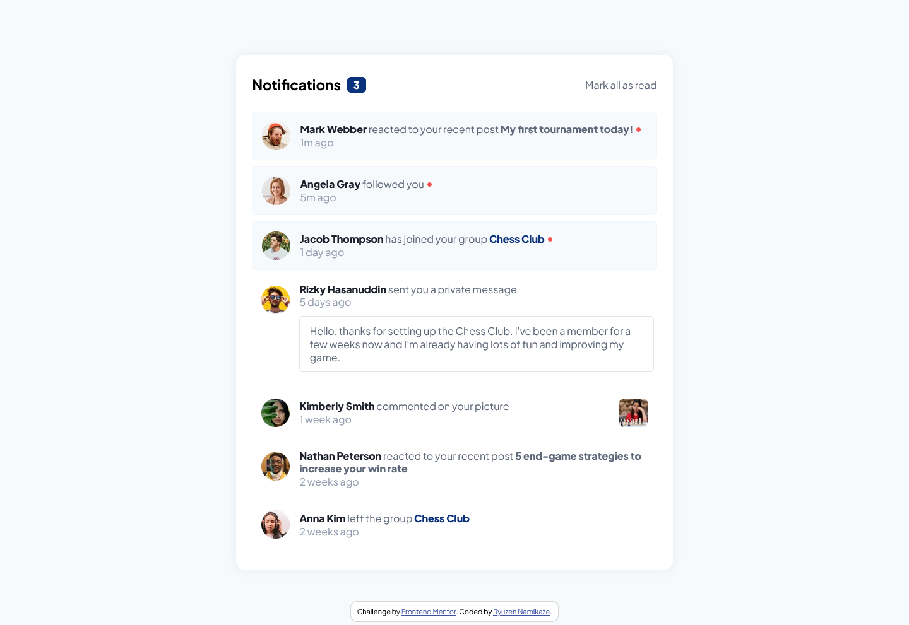

# Frontend Mentor - Notifications page solution

This is a solution to the [Notifications page challenge on Frontend Mentor](https://www.frontendmentor.io/challenges/notifications-page-DqK5QAmKbC). Frontend Mentor challenges help you improve your coding skills by building realistic projects. 

## Table of contents

- [Overview](#overview)
  - [The challenge](#the-challenge)
  - [Screenshot](#screenshot)
  - [Links](#links)
- [My process](#my-process)
  - [Built with](#built-with)
- [Author](#author)

## Overview

### The challenge

Users should be able to:

- Distinguish between "unread" and "read" notifications
- Select "Mark all as read" to toggle the visual state of the unread notifications and set the number of unread messages to zero
- View the optimal layout for the interface depending on their device's screen size
- See hover and focus states for all interactive elements on the page

### Screenshot

### Links

- Live Site URL: [GitHub Pages](https://rnamikaze.github.io/notification-page-fm/)

## My process

### Built with

- Flexbox

## Author

- Website - [Yusuf Bagus](https://crdrgn.site)
- Frontend Mentor - [@rnamikaze](https://www.frontendmentor.io/profile/rnamikaze)
- Twitter - [@ryuzen_namikaze](https://www.twitter.com/ryuzen_namikaze)
